<h1 align="center"> Hi, I'm <a href="https://www.linkedin.com/in/soutobias/">Tobias</a> </h1>

I am an Full-Stack Engineer with a strong background in React and Python and big geospatial data, complemented by expertise in environmental science, weather data, data science, and project management.

 

  
  
  
  
  

<h3 align="center"> My GitHub Stats</h3>

<h3 align="center"> Main projects</h3>

<table>
  <tr>
    <td>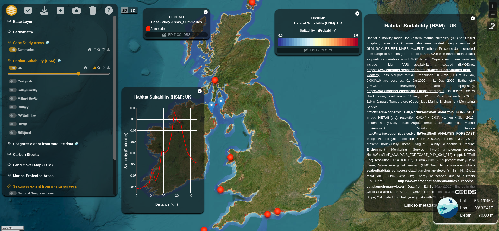</td>
    <td>
      <strong>Coastal Ecosystem Enhancement Decision Support (CEEDS) tool</strong>
      
      
      </a> 
      A tool that consolidates all data from the ReSOW UK project into an accessible, spatially-explorable format that aligns with user's needs and priorities. 
      <em>Contributions: entire application</em> 
      
      
      
      
      
       
      
    </td>
  </tr>
  <tr>
    <td>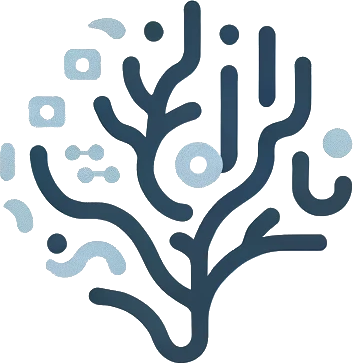</td>
    <td>
      <strong>PAIDIVERPY - <em>On going project</em></strong>
       
      A Python package designed to create pipelines for preprocessing image data for biodiversity analysis. 
      <em>Contributions: main developer.</em> 
      
      
      
    </td>
  </tr>
  <tr>
    <td>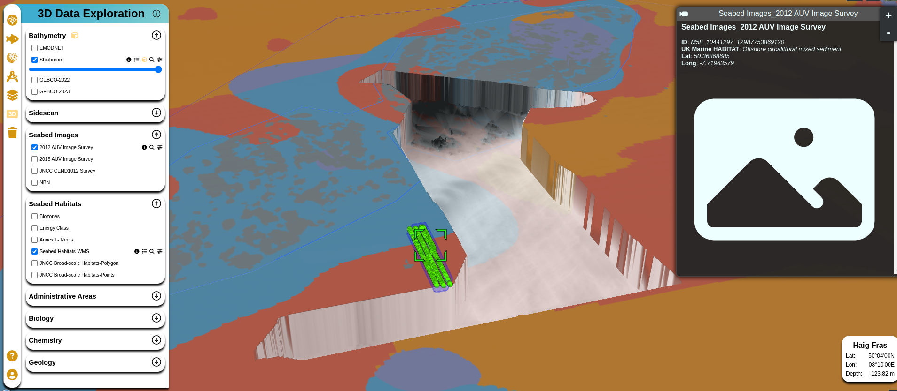</td>
    <td>
      <strong>Environmental Digital Twin Pilot Project for Haig Fras</strong>
      
      
      </a> 
      An  Environmental Digital Twin Pilot Project for a Marine Protected Area in the UK (Haig Fras MPA). 
      <em>Contributions: entire application</em> 
      
      
      
      
      
       
    </td>
  </tr>
  <tr>
    <td>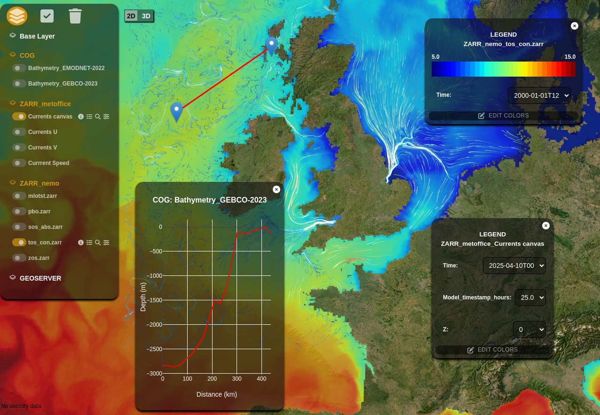</td>
    <td>
      <strong>Atlantis Visualization Tool - <em>On going project</em></strong>
      
      
      </a> 
      A full-stack application to visualize all the environmental data collected on the Work Packages of Atlantis Project 
       
      <em>Contributions: entire application</em> 
      
      
      
      
      
      
      
      
      
       
      
    </td>
  </tr>
  <tr>
    <td>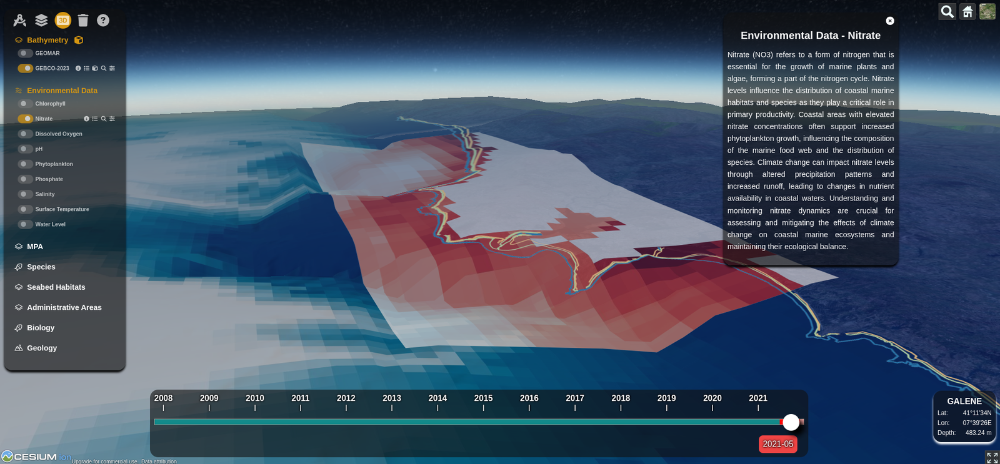</td>
    <td>
      <strong>Galene: an AI-powered model to guide solutions to climate change</strong>
      
      
       
      An AI-powered model and full-stack application aimed at guiding nature-based solutions for climate change in Portugal. 
      <em>Contributions: front-end and data pipelines</em> 
      
      
       
    </td>
  </tr>
  <tr>
    <td>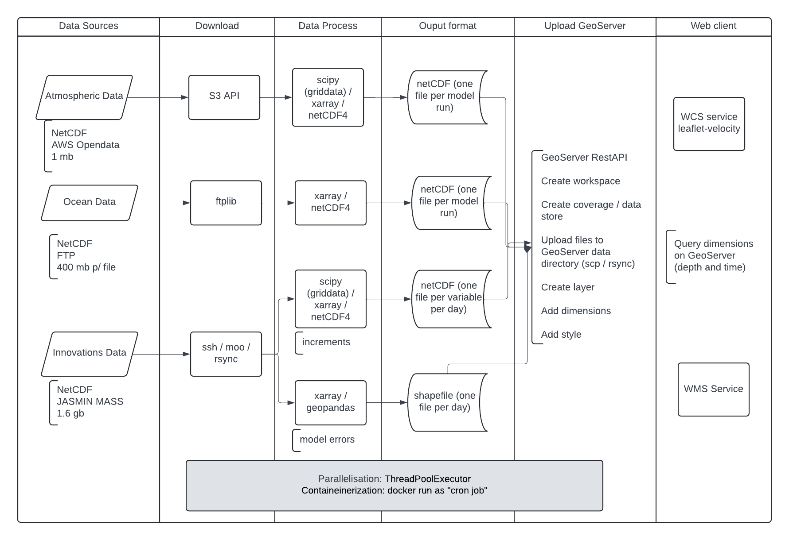</td>
    <td>
      <strong>MASDT: Marine Autonomous Systems Digital Twin</strong>
      
      
      </a> 
      A digital twin for the Marine Autonomous Systems of National Oceanography Centre (NOC). 
      <em>Contributions: weather model data ETL and geoserver</em> 
      
    </td>
  </tr>
  <tr>
    <td>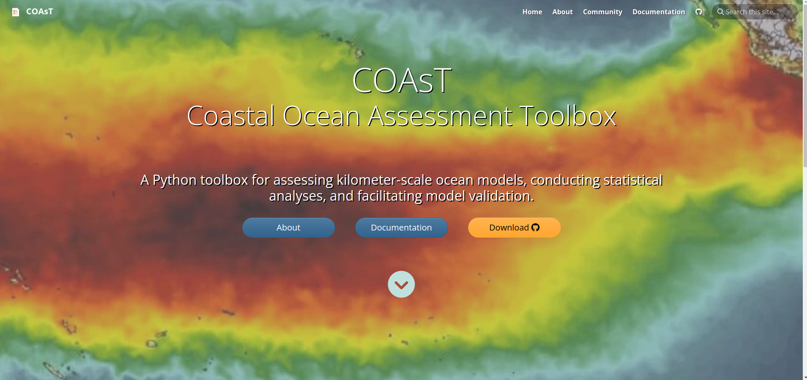</td>
    <td>
      <strong>Coastal Ocean Assessment Toolbox (COAsT)</strong>
       
      A Python toolbox for evaluating kilometer-scale ocean models, conducting statistical analyses, and facilitating model validation. 
      <em>Contributions: development of new features related to data visualization, code optimization, CI/CD codes and adapt code to cloud-optimized data formats.</em> 
      
      
      
    </td>
  </tr>
  <tr>
    <td>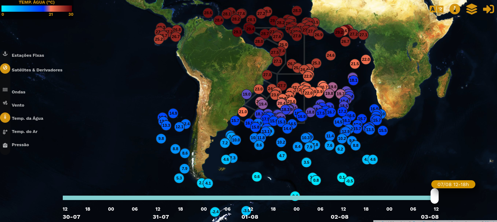</td>
    <td>
      <strong>OCEANOS.LIVE</strong>
      
      
      </a>
      
      </a> 
      A full-stack application to handle all free meteoceanographic data available in real time for the South Atlantic. 
      <em>Contributions: entire application</em> 
      
      
      
       
    </td>
  </tr>
  <tr>
    <td>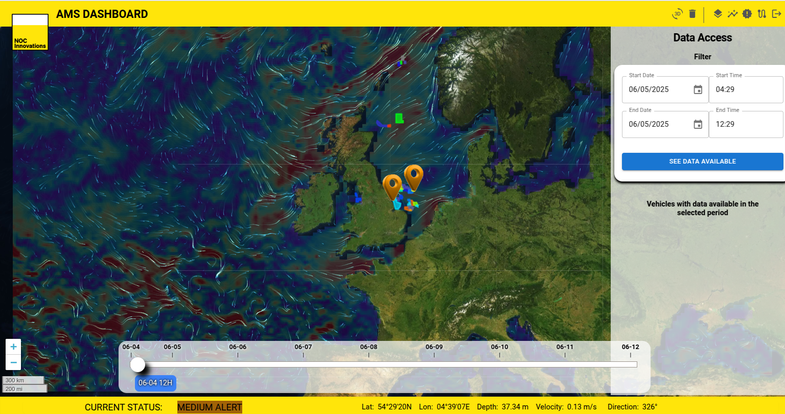</td>
    <td>
      <strong>Dashboard for Persistent Autonomous Monitoring Service</strong>
      
      
      </a> 
      Develop a functional Phase 1 dashboard for the CCS Carbon Dioxide Monitoring Project for use by oil and gas organizations. 
      <em>Contributions: entire backend end, frontend and data engineer</em> 
       
    </td>
  </tr>
  <tr>
    <td>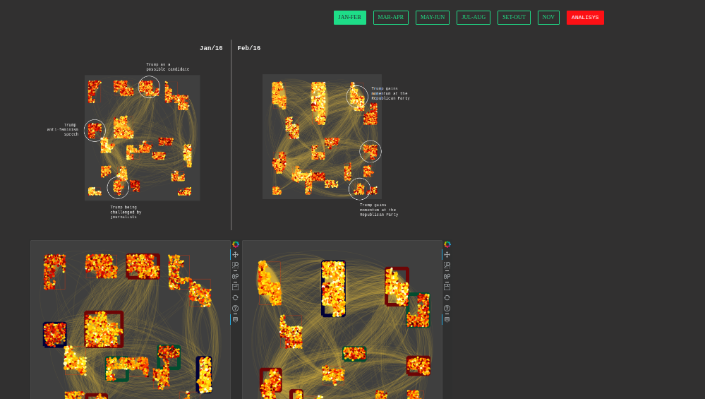</td>
    <td>
      <strong>DHARMA PROJECT</strong>
      
      
      </a> 
      NLP analysis for Brazil and US Ellections using deep learning techniques and pre-trained sentiment analysis models. 
      <em>Contributions: backend and entire frontend</em> 
      
      
      
       
    </td>
  </tr>
  <tr>
    <td></td>
    <td>
      <strong>PNBOIA: Brazilian National Buoy Program</strong>
      
      
      </a>
      
      </a> 
      
      </a> 
      Command and control system for managing the weather buoys of the National Buoys Program, and is related to data mining, data engineer, databases and frontend applications. 
      <em>Contributions: main developer</em> 
      
      
      
      
      
      
      
    </td>
  </tr>
  <tr>
    <td>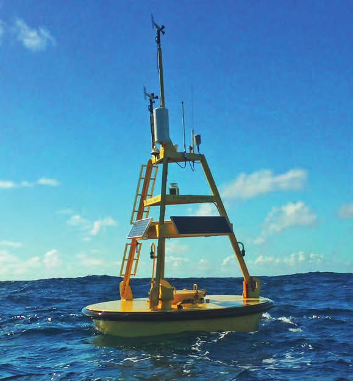</td>
    <td>
      <strong>Data QC: Weather Data Quality Control Toolbox</strong>
       
      An open-source Python toolbox for quality control of time series data collected in the ocean, specifically for the Brazilian National Buoy Program (PNBOIA).</em> 
      <em>Contributions: main developer.</em> 
      
      
    </td>
  </tr>
  <tr>
    <td>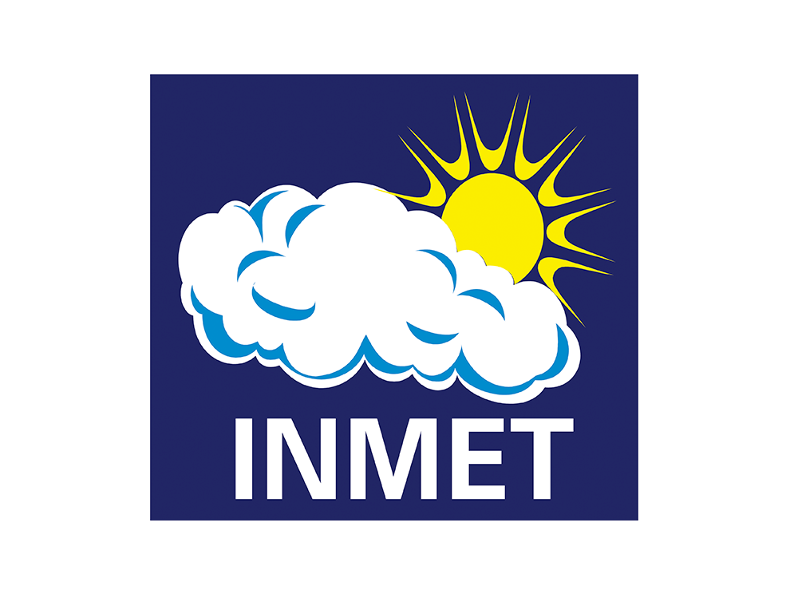</td>
    <td>
      <strong>inmetPy</strong>
       
      An open-source Python package to consume the API from the Brazilian National Institute of Meteorology (INMET). 
      <em>Contributions: development of some features.</em> 
      
      
    </td>
  </tr>
  <tr>
    <td>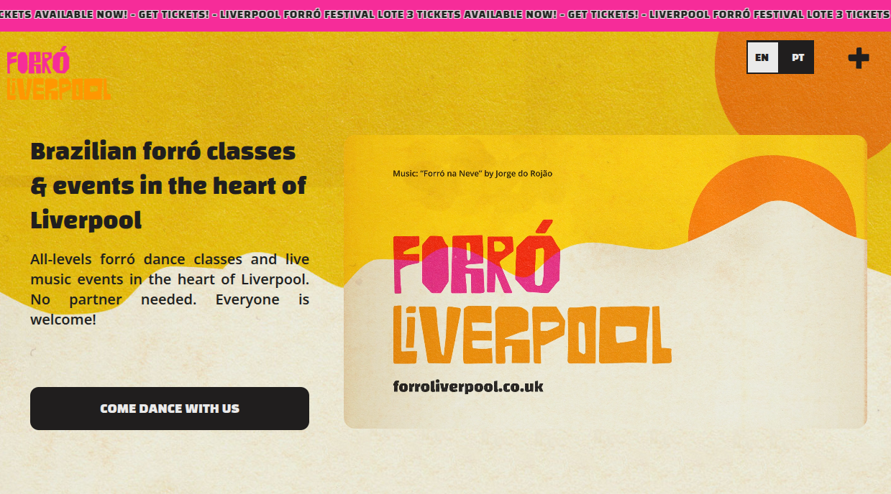</td>
    <td>
      <strong>Forro Liverpool</strong>
      
      </a>
      
      </a> 
      A web application to manage the Forró Liverpool community, including events, members, and more. 
      <em>Contributions: main developer.</em> 
      
       
    </td>
  </tr>
</table>
